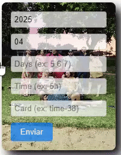

# 🕒 Timesheets Fill Helper – Tampermonkey Script
A small utility that makes your Jira timesheet life easier by allowing quick time entry with a friendly floating widget. This is powered by Tampermonkey, a popular userscript manager.

# ✅ Features
Draggable UI

Custom time, date, and card entry

Support for entering multiple days (e.g., 5 6 7)

Simple one-click submission to your API

Auto-reset UI with visual feedback

# 🚀 Getting Started
## Step 1: Install Tampermonkey Extension
Depending on your browser, install Tampermonkey from the official website:

🧩 Chrome Web Store

🦊 Firefox Add-on

🧪 Edge Add-on

Click Add to Browser and complete the install.

## Step 2: Open Tampermonkey Dashboard
Click the Tampermonkey icon in your browser toolbar.

Select Dashboard.

## Step 3: Add a New Script
In the dashboard, click the ➕ Create a new script... button.

Remove the default code.

Paste in the contents of timesheets-helper.user.js (the script in this repo).

Press File > Save (or hit Ctrl+S / Cmd+S).

## Step 4: Use the Script
Visit your Jira Time Log page (e.g., https://pressganey.atlassian.net/*timela*).

You should see a draggable floating box titled Enviar.

Fill in:

Year (auto-filled)

Month (auto-filled)

Day(s) – supports multiple days like 5 6 7

Time Spent – example: 4h

Card – example: time-123

Click Enviar to submit.

# 🛠️ Configuration
If you want to change the API URL or behavior, look for this section in the script:

javascript
Copy
Edit
const url = `url`; // Replace with your actual API endpoint
Replace url with your own backend endpoint where time logs should be sent.

# ✨ Bonus Tips
All inputs become fully opaque when focused (opacity: 1) and fade to 0.7 when unfocused.

Hover over inputs to see smooth opacity transitions.

The floating box can be dragged anywhere on screen and remembers its position during a session.

##  📽️ Preview

#💡 Contributing
Feel free to fork the repo and improve it! PRs are welcome.

#📜 License
MIT License